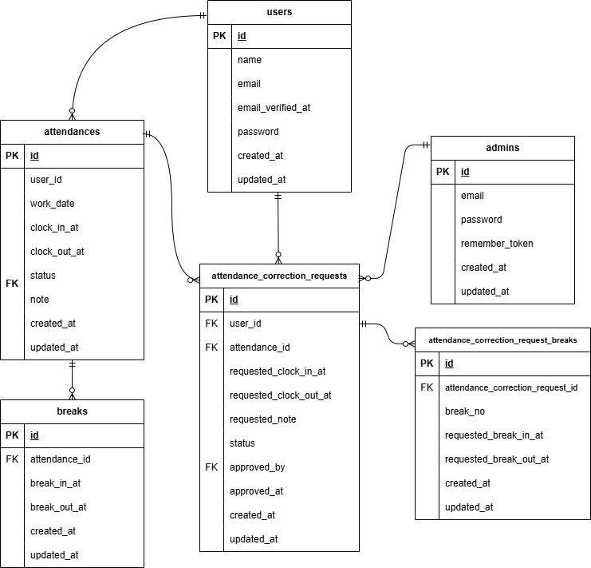

# 勤怠管理アプリ

## 環境構築

### Docker ビルド

1.  リポジトリを取得

    ```bash
    git clone git@github.com:matsu-shima-130/attendance-exam.git
    cd attendance-exam
    ```

2.  コンテナを作成・起動

    ```bash
    docker-compose up -d --build
    ```

    ＊MYSQL は、OS によって起動しない場合があるのでそれぞれの PC に合わせて docker-compose.yml ファイルを編集してください。

### Laravel 環境構築

1. PHP コンテナに入る

   ```bash
   docker-compose exec php bash
   ```

2. 依存パッケージのインストール & 環境ファイル作成

   ```bash
   composer install
   cp .env.example .env
   php artisan key:generate
   ```

3. .env の DB 設定

   ```bash
   DB_CONNECTION=mysql
   DB_HOST=mysql
   DB_PORT=3306
   DB_DATABASE=laravel_db
   DB_USERNAME=laravel_user
   DB_PASSWORD=laravel_pass
   ```

4. マイグレーション

   ```bash
   php artisan migrate
   ```

5. シーディング

   ```bash
   php artisan db:seed
   ```


6. メール認証設定（MailHog）

   - メール認証機能には MailHog を使用しています。
   - .env を以下のように設定します

   ```bash
   MAIL_MAILER=smtp
   MAIL_HOST=mailhog
   MAIL_PORT=1025
   MAIL_FROM_ADDRESS=no-reply@example.com
   MAIL_FROM_NAME="Attendance App"
   ```
   - 設定反映

   ```bash
   php artisan config:clear
   ```
   - 会員登録後、/email/verify に遷移し、MailHog の受信ボックスに届いたメールから認証リンクをクリックするとメール認証が完了します。

7. テスト
   - PHPUnit による Feature テストを実装しています。
   ```bash
   php artisan test
   ```
   - 特定のテストクラスだけ実行したい場合は --filter を使用します。

   ```bash
   # ID1 認証機能（一般ユーザー）
   php artisan test --filter=RegisterTest

   # ID2 ログイン認証機能（一般ユーザー）
   php artisan test --filter=LoginTest

   # ID3 ログイン認証機能（管理者）
   php artisan test --filter=AdminLoginTest

   # ID4 日時取得機能
   php artisan test --filter=DateTimeTest

   # ID5 ステータス確認機能
   php artisan test --filter=AttendanceStatusTest

   # ID6 出勤機能
   php artisan test --filter=AttendanceClockInTest

   # ID7 休憩機能
   php artisan test --filter=AttendanceBreakTest

   # ID8 退勤機能
   php artisan test --filter=AttendanceClockOutTest

   # ID9 勤怠一覧情報取得機能（一般ユーザー）
   php artisan test --filter=AttendanceListTest

   # ID10 勤怠詳細情報取得機能（一般ユーザー）
   php artisan test --filter=AttendanceDetailTest

   # ID11 勤怠詳細情報修正機能（一般ユーザー）
   php artisan test --filter=AttendanceCorrectionValidationTest

   # ID12 勤怠一覧情報取得機能（管理者）
   php artisan test --filter=AdminAttendanceListTest

   # ID13 勤怠詳細情報取得・修正機能（管理者）
   php artisan test --filter=AdminAttendanceDetailTest

   # ID14 ユーザー情報取得機能（管理者）
   php artisan test --filter=AdminStaffTest

   # ID15 勤怠情報修正機能（管理者）
   php artisan test --filter=AdminStampCorrectionRequestTest

   # ID16 メール認証機能
   php artisan test --filter=EmailVerificationTest
   ```
   - テスト内容はテストケース一覧に準拠しています。

## 管理者アカウント（AdminSeeder で作成）

- email: admin@example.com
- password: password123

## 一般ユーザーアカウント（UserAttendanceSeeder で作成）

- Seeder 実行時に一般ユーザーを 5 人作成します（メールアドレスはランダム生成）。
- パスワードは全ユーザー共通で `password123` です。
- 勤怠データは「前月、今月、来月の 3 ヶ月分」を投入します（平日のみ、ランダムで休みあり）。
- 休憩データは 1 日あたり 0〜2 回のランダムで投入します。

### 一般ユーザーのログイン方法（メールアドレスの確認）

以下のいずれかでメールアドレスを確認してログインしてください。

#### 方法1：Tinker で確認

```bash
php artisan tinker
User::first(['id','name','email'])->toArray();
```

#### 方法2：phpMyAdmin で確認
phpMyAdmin（ http://localhost:8080/ ）から users テーブルを確認してください。

## 使用技術

- PHP 8.1.33
- Laravel 8.83.8
- MySQL 8.0.26
- Nginx 1.21.1

## URL

- 開発環境: http://localhost/
- phpMyAdmin: http://localhost:8080/
- MailHog: http://localhost:8025

## ER 図


